# ***Creating High Availability Architecture with AWS CLI***

<p align="center">
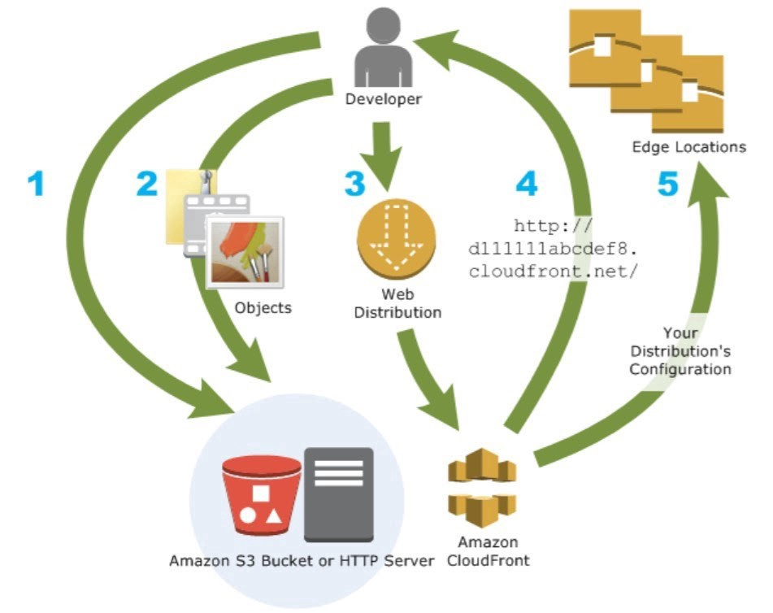
</p>

## Task Description📄
✔ Web Server configured on EC2 Instance </br>
✔ Document Root(/var/www/html) made persistent by mounting on EBS Block Device. </br>
✔ Static objects used in code such as pictures stored in S3 </br>
✔ Setting up a Content Delivery Network using CloudFront and using the origin domain as S3 bucket. </br>
✔ Finally placing the CloudFront URL on the web app code for security and low latency. </br>

***Before Moving Further Lets Understand what is AWS S3 and AWS CloudFront*** **🤔**

> ***AWS S3:***
<p align="center">
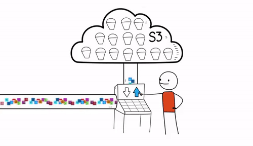
</p>
Amazon Simple Storage Service (Amazon S3) is an object storage service that offers industry-leading scalability, data availability, security, and performance. Amazon S3 is designed for 99.999999999% (11 nine’s) of durability, and stores data for millions of applications for companies all around the world. for more info

[here](https://aws.amazon.com/cloudfront/)

>***AWS CloudFront:***
<p align="center">
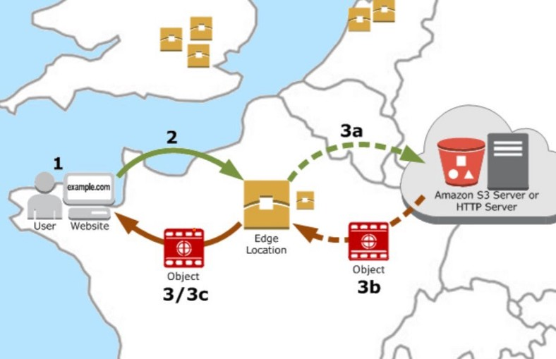
</p>
Amazon CloudFront is a fast content delivery network (CDN) service that securely delivers data, videos, applications, and APIs to customers globally with low latency and high transfer speeds. for more info here

## ***Now Lets Begin:***👉
First we will launch an AWS instance. Here I am using a pre-created security group and key-pair although we can create it easily over AWS CLI in just a few commands. you can refer my previous article for this purpose [here](https://gauravpagare2001.medium.com/launching-aws-instance-with-cli-5c46f124bf31)

<p align="center">
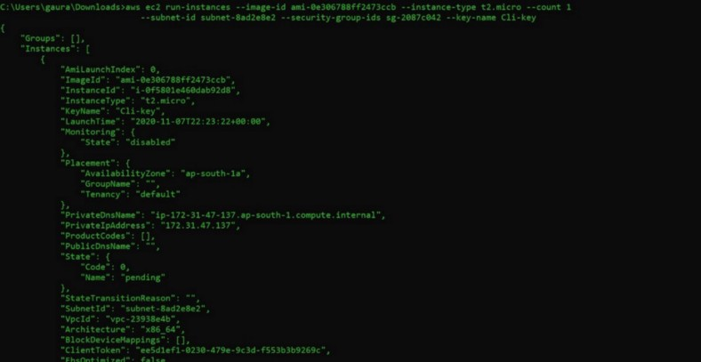
</p>

Now we will launch create an EBS volume to get an persistent storage for our web code

<p align="center">
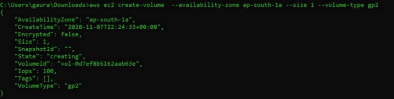
</p>

Now we need to attach this ebs volume to our newly launched AWS instance

<p align="center">
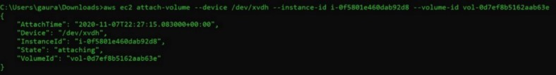
</p>

With the ssh we can connect to the aws instance running for this we need its public IP which we can get by doing query over the ec2 describe instance command

<p align="center">
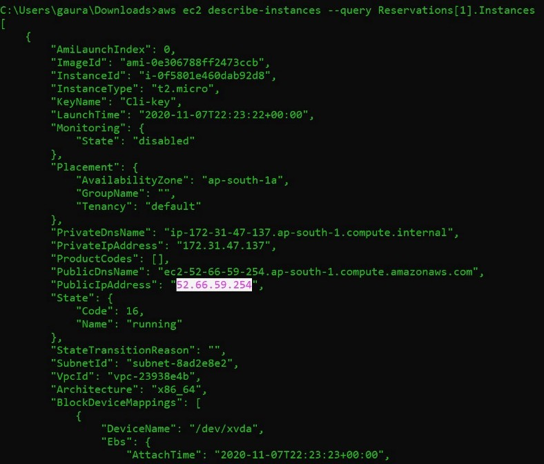
</p>

Now with the public IP and the key-pair we can easily connect to the AWS instance via ssh

<p align="center">
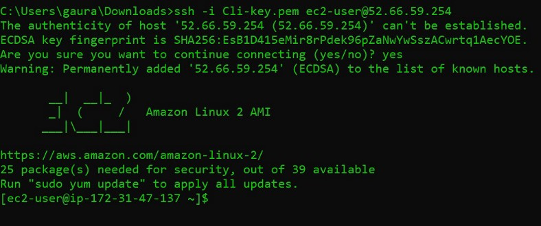
</p>

Now our aim is to launch a httpd web services here and then mount the folder /var/www/html to secondary ebs storage attached to this instance to achieve persistent storage

<p align="center">
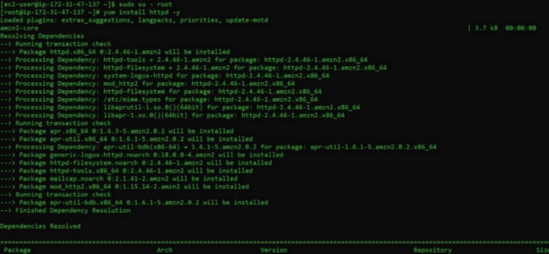
</p>

With the yum we have installed the httpd and with systemctl can start the services and further permanently enable it. for this make sure you are using sudo powers or login via root user

<p align="center">
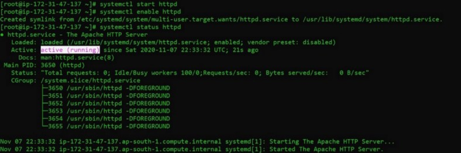
</p>

Now to use the secondary attached ebs volume we need to go inside the hard disk and create a partition of required size in it
with the ```#fdisk -l``` command we can see the available volume in the instance

<p align="center">
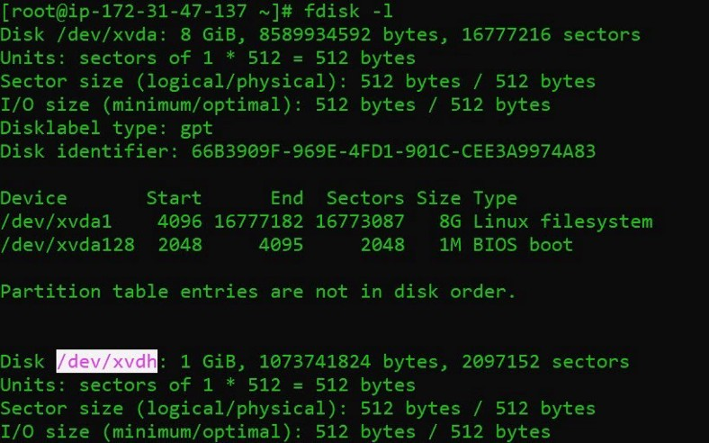
</p>

with ```#fdisk <Hd_name> ```command we can go inside the hard disk and create a partition there

<p align="center">
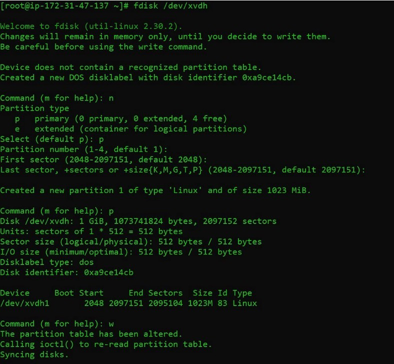
</p>

In my case I have used all the space of the hard disk and created a partition. After the partition is created we need to save it using the “w” option.

Now we need to create a filesystem in the partition (Format the partition) here I have used the ext4 format type. we can format using the command.

```#mkfs.<format_type> <hd_name>```

<p align="center">
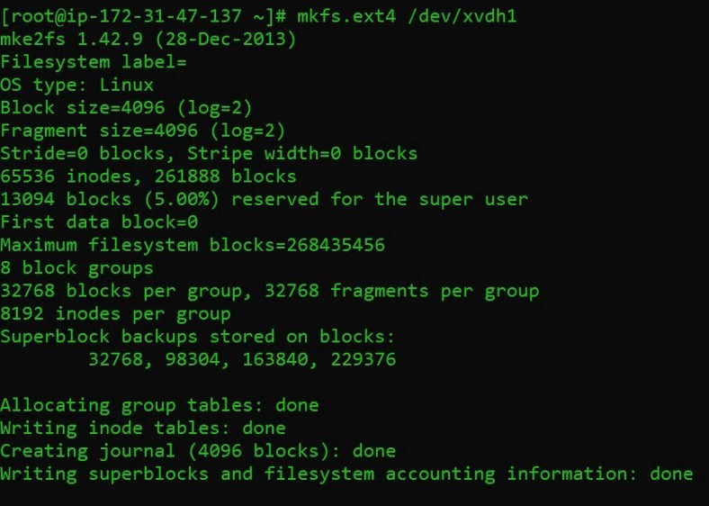
</p>

Now when we have successfully created the filesystem over the partition we are ready to mount. I have mount the partition to the /var/www/html folder because it is the folder from where we keep our web pages in case of httpd web servers

<p align="center">
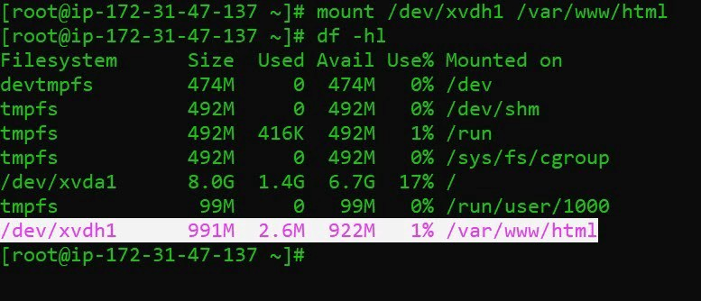
</p>

Now from the AWS web portal let’s check whether all things are updated accordingly till now or not

<p align="center">
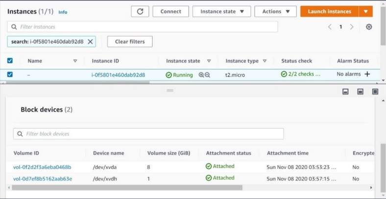
</p>

Now in our web pages we may have the code, images, videos, etc. for this we can use the Amazon S3. so we need to create the S3 bucket in the required region. In the bucket we will be uploading the objects. bucket and the objects both should be given proper permissions so that we could access it here I have given the public-read permission

<p align="center">
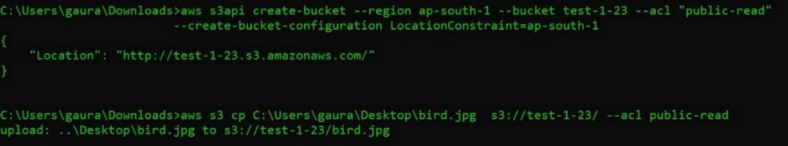
</p>

<p align="center">
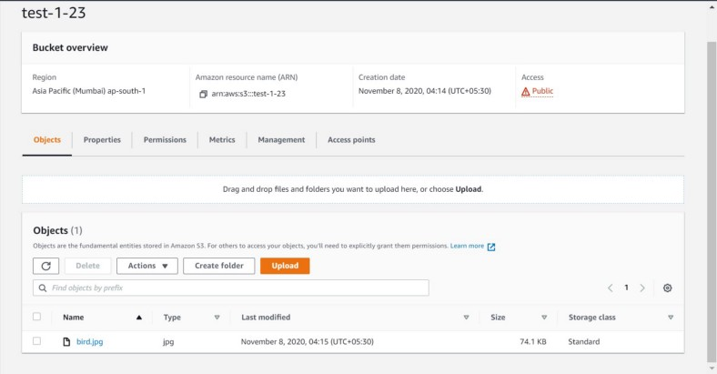
</p>

Now we need to deliver our content in a fast and efficient way. For this we use the AWS CDN service AWS CloudFront. In this our source of content (origin) is the s3 bucket we created. Now cloudfront will be using the power of AWS edge location to deliver the content all over the globe.

<p align="center">
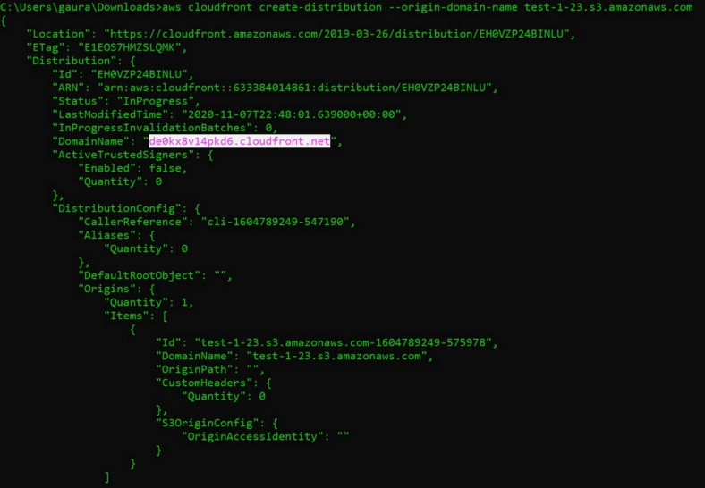
</p>

<p align="center">
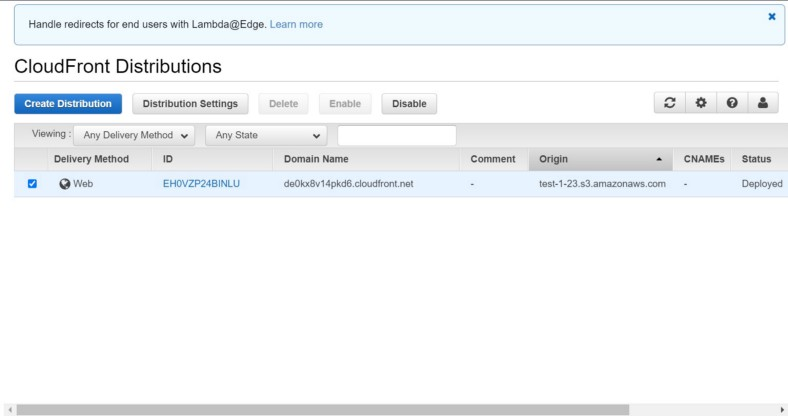
</p>

Once we create the cloudfront we get a unique domain name which we can give to our developers which they can use in their web code.

<p align="center">
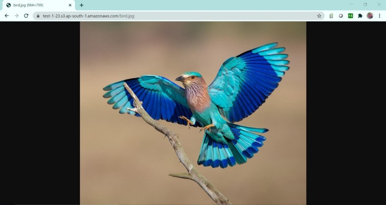
</p>

Now when we put our code in the /var/www/html for the client they will receive the webcode for the EBS volume and the content like images and videos via cloudfront in fast and efficient way

<p align="center">
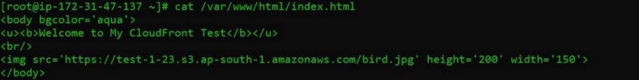
</p>

<p align="center">
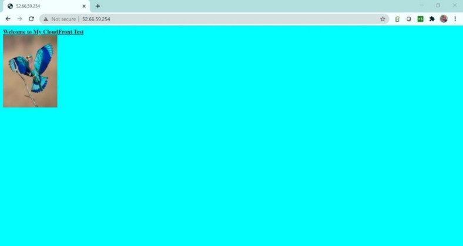
</p>

## ***So now we have we have successfully performed the task 🎖🎖🙌***
## ***Thank You For Reading ……***
## ***Feel Free to Drop any kind of suggestions and queries they are always welcome : [Here](https://www.linkedin.com/in/gaurav-pagare-8b721a193/)***😊
